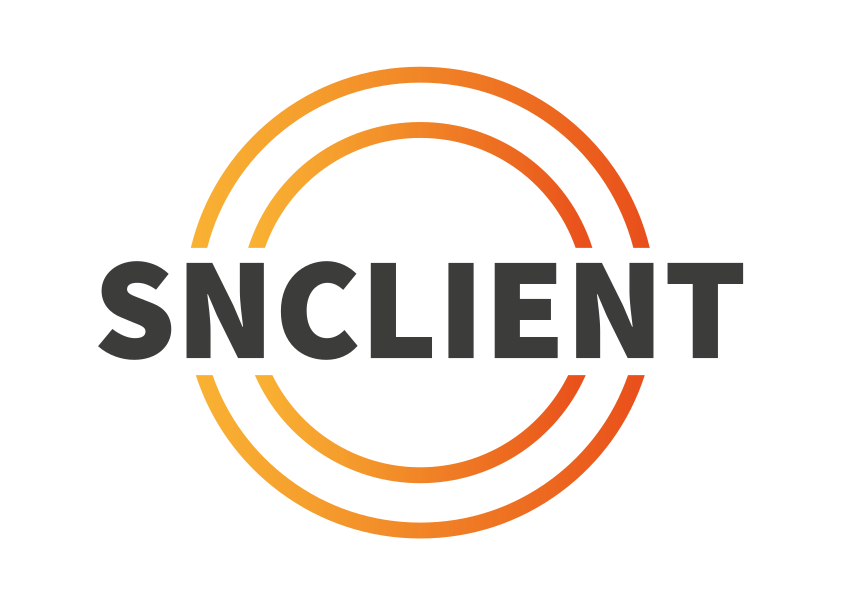

# SNClient+

SNClient+ (Secure Naemon Client) is a general purpose monitoring agent designed as replacement for NRPE and NSClient++.

## Supported Operating Systems

|         | i386 | x64 | arm64 |
|---------|------|-----|-------|
| Linux   |   X  |  X  |   X   |
| Windows |   X  |  X  |       |
| FreeBSD |   X  |  X  |   X   |
| MacOSX  |      |  X  |   X   |

## Supported Protocols

- Prometheus HTTP(s)
- NRPE (v2/v4)
- NSCP Rest API via HTTP(s) (checks only)

## Installation

There are prebuild binaries and packages for the all supported systems (see above) on the
[release page](https://github.com/Consol-Monitoring/snclient/releases).

Further details are covered in the [documentation](https://omd.consol.de/docs/snclient/).

## Implementation Status

W: work in progress
X: completed

|                        | Windows |  Linux  |   OSX   |   BSD   |
|------------------------|---------|---------|---------|---------|
| check_alias            |    X    |    X    |    X    |    X    |
| check_cpu              |    X    |    X    |    X    |    X    |
| check_drivesize        |    X    |    X    |    X    |    X    |
| check_dummy            |    X    |    X    |    X    |    X    |
| check_eventlog         |    W    |         |         |         |
| check_files            |    W    |    W    |    W    |    W    |
| check_index            |    X    |    X    |    X    |    X    |
| check_load             |    X    |    X    |    X    |    X    |
| check_memory           |    X    |    X    |    X    |    X    |
| check_network          |    X    |    X    |    X    |    X    |
| check_os_version       |    X    |    X    |    X    |    X    |
| check_pagefile         |    X    |         |         |         |
| check_process          |    W    |    W    |    W    |    W    |
| check_service          |    X    |    X    |         |         |
| check_snclient_version |    X    |    X    |    X    |    X    |
| check_tasksched        |         |         |         |         |
| check_uptime           |    X    |    X    |    X    |    X    |
| check_omd              |         |    X    |         |         |
| check_wmi              |    X    |         |         |         |
| check_wrap             |    X    |    X    |    X    |    X    |

## Roadmap

Find a brief overview of what is planned and what is done already:

### Stage 1

- [X] support NRPE clients
- [X] support NSCP rest api clients
- [X] support basic Prometheus metrics
- [X] implement reading nsclient.ini files
- [X] implement ssl/tls support
- [X] implement authenticaton / authorization
  - [X] basic auth
  - [X] client certificates
  - [X] allowed hosts
  - [X] allow arguments
  - [X] allow nasty characters
- [X] add build pipeline
  - [X] build windows msi packages
  - [X] build debian/ubuntu .deb packages
  - [X] build rhel/sles .rpm packages
  - [X] build osx .pkg packages
- [X] implement log rotation for file logger
- [X] self update (from configurable url)
- [X] implement perf-config
- [ ] finish builtin checks
- [ ] implement help with examples and filters
- [ ] review check plugin status

### Stage 2

- [X] add basic prometheus exporters
  - [X] exporter_exporter
  - [X] windows_exporter
  - [X] node_exporter
  - [ ] add time support in threshold, ex.: warn=time > 18:00 && load > 10
- [X] add config include folder

### Stage 3

- [X] self update from github
- [ ] open telemetry
- [ ] check usr signal handler
- [ ] improve configuration
  - [ ] add config validator
  - [ ] use strong typed config items
- [ ] osx
  - [ ] check pkg uninstall
- [ ] rename packages to avoid confusion: amd64 -> x86-64, 386 -> i386, amd64 -> aarch64

## Not gonna happen

The following things will most likely not be part of snclient any time:

- CheckMK support
- Embedded LUA support
- Embedded Python support
- Graphite support
- NRDP support
- NSCA support
- SMTP support
- Website/Rest API (except doing checks)
- check_nt support

## Release

A new release can be build by following these steps:

- Verify the test status is green on the [github actions](https://github.com/ConSol-Monitoring/snclient/actions/workflows/cicd.yml) page.
- If not already there, add a `next:` entry to the changelog.

  (ex.: as in git show b2e1b020ed462196670068034fdee87ee33814ac)

  Then have a look at `git log` and add missing changes.

- Run `make release` and choose a new version. Usually just increment the
  minor number unless there are breaking changes.
- Check `git log -1` and `git diff HEAD` if things look good.

  Ex. the changelog should contain the current version tag now.

- Push the release commit with `git push` and `git push --tags`

- Watch the github action build the release packages on the [github actions](https://github.com/ConSol-Monitoring/snclient/actions/workflows/cicd.yml) page.

  The one with the git tag will also create a draft release. So when the action
  is ready, go to the [releases page](https://github.com/ConSol-Monitoring/snclient/releases)
  and edit the last tag, scroll down and publish the release.
