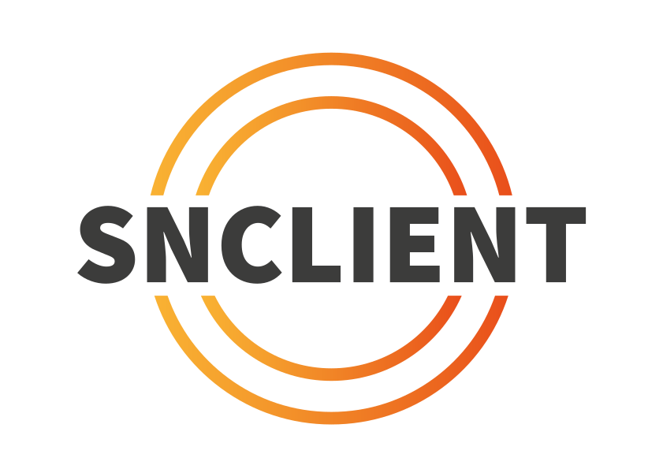

**SNClient** is an open-source (drop-in for most use cases) general purpose monitoring agent as replacement for the well-known NSClient++.

It was written from scratch in [Golang](https://go.dev/) using todays state-of-the-art technologies. All the test and build procedures are located on [GitHub](https://github.com/ConSol-Monitoring/snclient).

It's available for Linux, Windows and MacOS for i386, x86_64 and arm64 ([detailed list of supported operating systems](./install/supported/)).

Have a look at the [installation](./install/) page for first steps.

## Nagios / Naemon and Prometheus

- SNClient supports the [Nagios / Naemon stack](./checks/) with nrpe or check_nsc_web.
- Prometheus is also supported with the [builtin node_exporter and windows_exporter](./prometheus/)

## Releases

The latest release can always be found [here](https://github.com/ConSol-Monitoring/snclient/releases).

## Talks

### 2023 - OSMC Nuremberg

- english - 33 minutes
- Talk: <https://www.youtube.com/watch?v=cXXZlnmn2NA>
- [Slides](https://labs.consol.de/_slides/snclient-2023-11-09.pdf)
