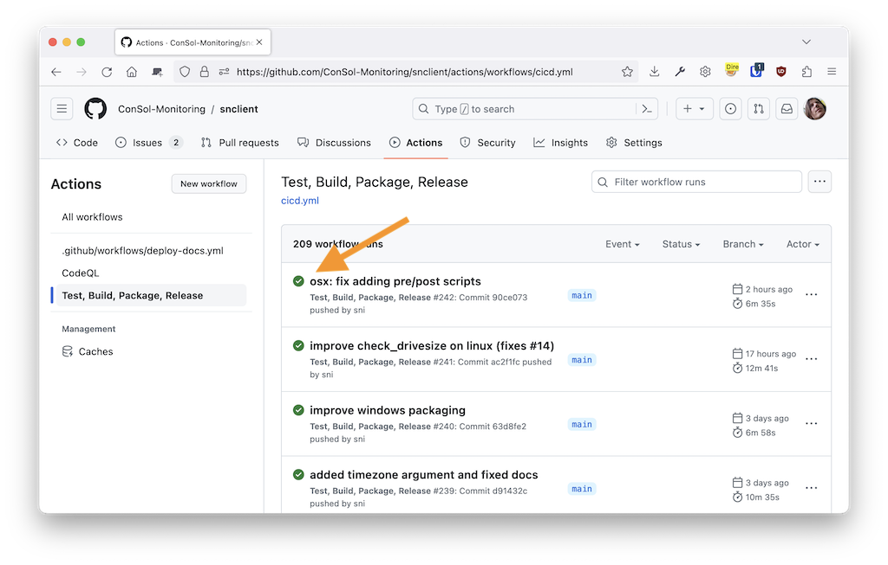
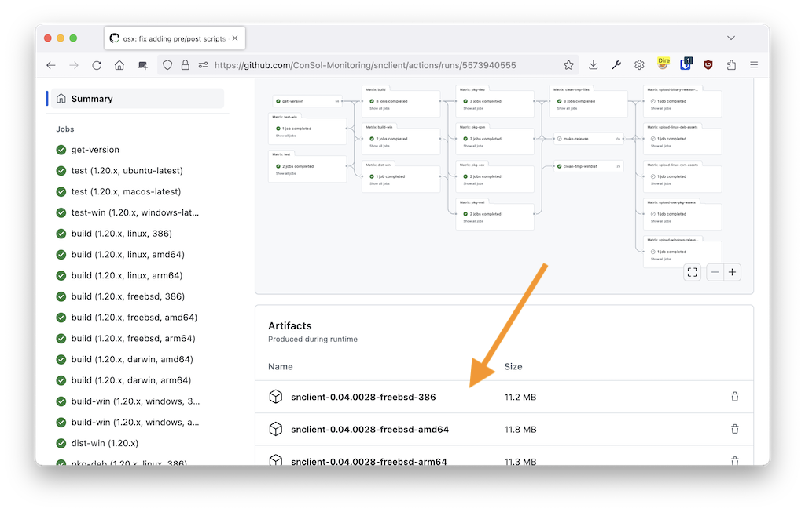

# Installation

## Using Binary Packages

Using packages is the recommended way to install SNClient+.

### Stable Releases
Installation packages from stable releases can be found here:

- https://github.com/ConSol-Monitoring/snclient/releases

### Development Snapshots
During development each code commit produces build artifacts if all tests were
successful.

Usually you should stick to the stable releases unless told otherwise or you want
to test something.

Installing the development snapshot is straight forward:

1. Open https://github.com/ConSol-Monitoring/snclient/actions/workflows/cicd.yml?query=branch%3Amain
2. Choose first green build like in
	
3. Scroll down and choose the download which matches your architecture:
	
4. Install just like the stable release files.

## Building SNClient From Source

Building snclient from source is covered in detail here: [Building from source](build)

## Firewall

The windows .msi package will add the firewall exceptions automatically. If you changed
the listener configuration, like ports or the enabled listeners, ex.: NRPE, Web
you can update the firewall configuration with this command:

	C:\Program Files\snclient> .\snclient.exe install firewall

If you don't need the exceptions anymore, there is an uninstall command as well:

	C:\Program Files\snclient> .\snclient.exe uninstall firewall