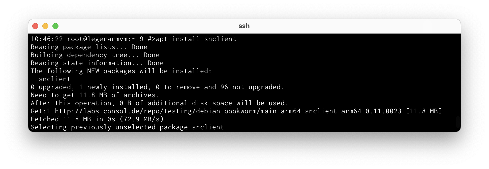

# Debian / Ubuntu

## Installation

Stable release installation packages can be found here:

- [ConSol Software Repository](https://labs.consol.de/repo/stable/) (recommended)
- [Github Releases](https://github.com/ConSol-Monitoring/snclient/releases)

Add the repository as described on the link itself.

    #> apt install snclient

### Firewall

The firewall should be configured to allow these ports:

- `8443` : if you enabled the webserver (the default is enabled)
- `5666` : if you enabled the NRPE server (disabled by default)
- `9999` : if you enabled the Prometheus server (disabled by default)

## Uninstall

Uninstall is available possible with `apt`.

    #> apt remove snclient
