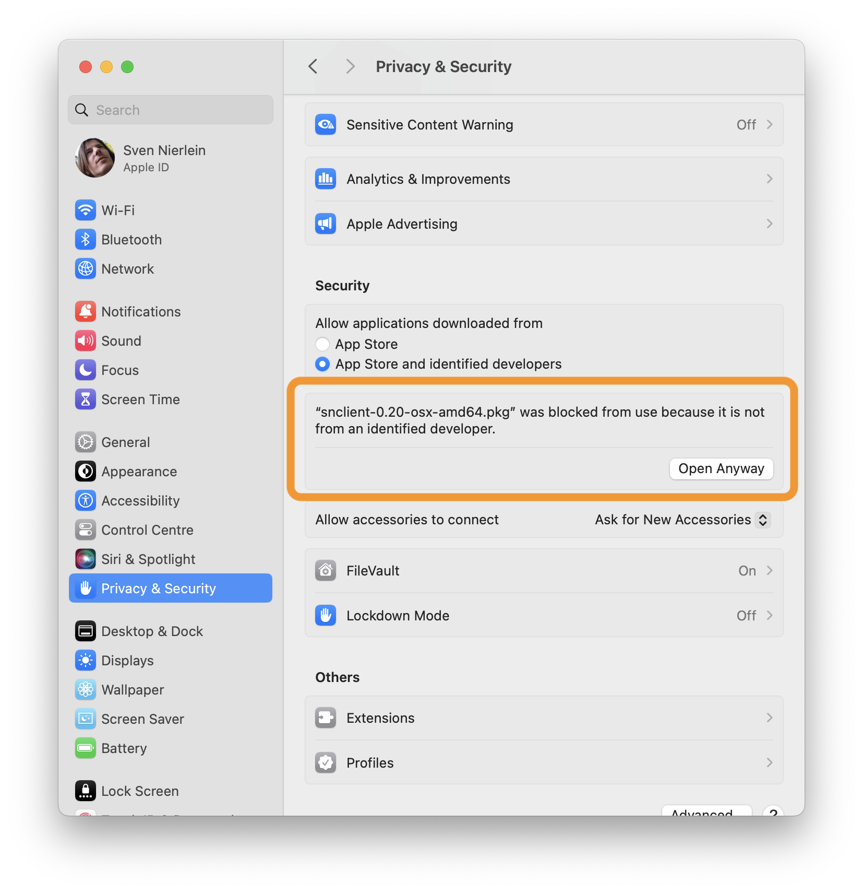

# OSX

## Installation

Stable release installation packages can be found here:

- [Github Releases](https://github.com/ConSol-Monitoring/snclient/releases)

Download the .pkg file from the releases page und start it. You might need to
open the system settings allow opening the package since it is not signed.

This should open the installer:

### Firewall

The firewall should be configured to allow these ports:

- `8443` : if you enabled the webserver (the default is enabled)
- `5666` : if you enabled the NRPE server (disabled by default)
- `9999` : if you enabled the Prometheus server (disabled by default)

## Uninstall

Uninstall is available possible with the uninstall shell script.

    %> sudo /usr/local/bin/snclient_uninstall.sh
