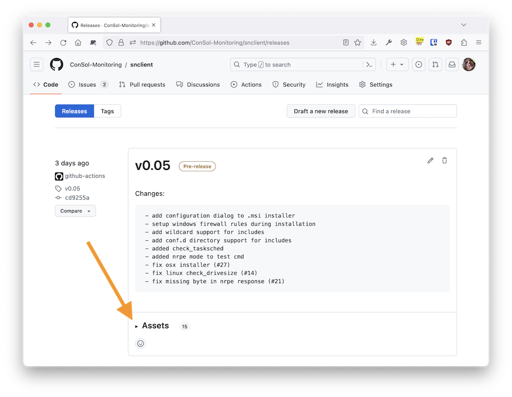

## Installation

Stable release installation packages can be found here:

- [SNClient Releases Page](https://github.com/ConSol-Monitoring/snclient/releases)

You might need to expand the assets to find the download links.

Then start the .msi installer and follow the instructions.

### Firewall

The windows .msi package will add the firewall exceptions automatically. in
case you need to re-install the firewall exception, you can run this command:

    C:\Program Files\snclient> .\snclient.exe install firewall

If you don't need the exceptions anymore, there is an uninstall command as well:

    C:\Program Files\snclient> .\snclient.exe uninstall firewall

### MSI Installation Parameters

Running the .msi installer manually lets you choose some basic options. The idea
here is to set the ports, so the following firewall setup will know which ports
to open.

All none basic options should go into a local custom ini file which can be
provided during installation as well.

Installing the msi from the terminal with `msiexec.exe` provides those options
as public property.

ex.:

    msiexec.exe /i snclient.msi /l*V snclient_installer.log /qn PASSWORD="test" INCLUDES="https://company.local/snclient_local.ini"

Installs the .msi and logs everything into the snclient_installer.log logfile. It
also sets the initial password and includes a ini file fetched by https.

Here is a table of all available properties:

| Property             | Default Value     | Description |
| -------------------- | ----------------- | ----------- |
| INCLUDES             |                   | Adds include files to the /Includes section. |
| ALLOWEDHOSTS         | 127.0.0.1, ::1    | Sets the 'allowed hosts'. |
| PASSWORD             | CHANGEME          | Sets the password (will be written to the .ini encrytped). |
| WEBSERVER            | 1                 | Enable/Disable the REST web server. |
| WEBSERVERPORT        | 8443              | Set port for web server. |
| WEBSERVERSSL         | 1                 | Enable/Disable TLS/SSL for the web server. |
| NRPESERVER           | 0                 | Enable/Disable the NRPE server. |
| NRPESERVERPORT       | 5666              | Set port for NRPE server. |
| NRPESERVERSSL        | 1                 | Enable/Disable TLS/SSL for the NRPE server. |
| PROMETHEUSSERVER     | 0                 | Enable/Disable the Prometheus web server. |
| PROMETHEUSSERVERPORT | 9999              | Set port for prometheus web server. |
| PROMETHEUSSERVERSSL  | 0                 | Enable/Disable TLS/SSL for the Prometheus web server. |

## Uninstall

Uninstall is available either by starting the `snclient.msi installer` again. If the installer has the same version as the
installed one, it will offer a uninstall` option.

Another way is to use the `windows software center` and uninstall the agent from there.
